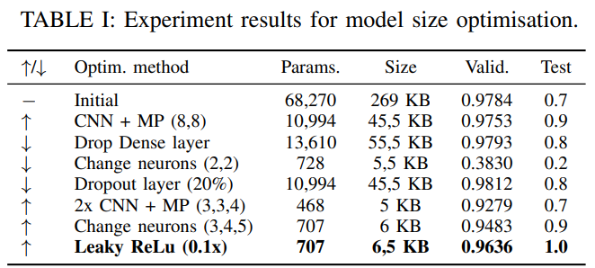
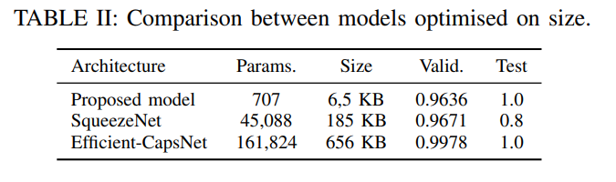

# Machine Learning for Embedded System course @ TalTech
Optimizing a deep-learning model based on size, resulting in a 6,5 kB model with 96,4% accuracy on MNIST.

For the background of the models' comparison, please consult Omar El Nahhas_IAS0360_hw2_20-10-2021.pdf.